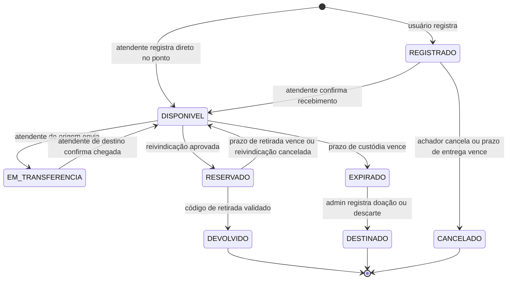
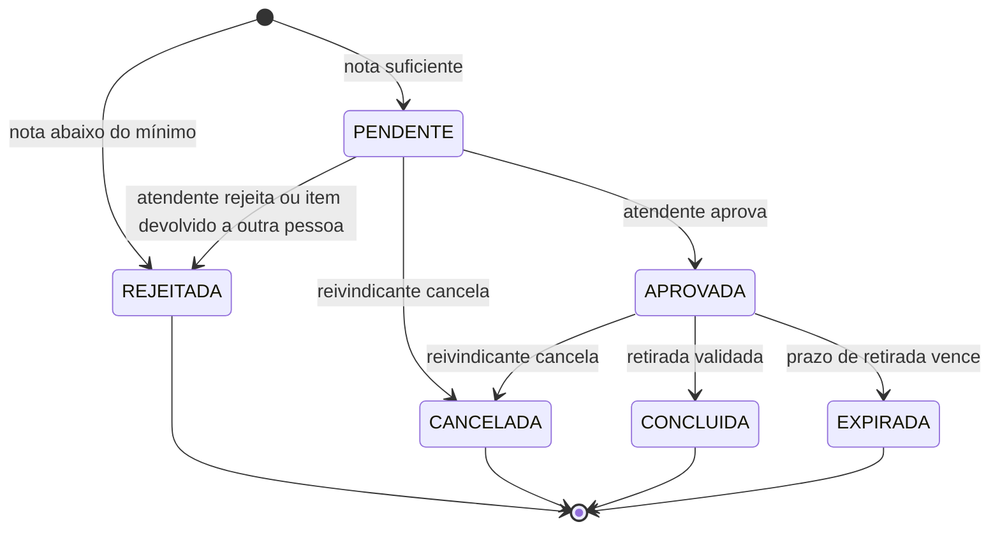

# Escopo do Sistema: Achados e Perdidos

> Documento de escopo e regras de negócio do projeto. Complementa os [requisitos da disciplina](requirements.md).
>
> **Equipe:** 3 pessoas · **Status:** proposta inicial, os prazos e pesos podem ser ajustados pela equipe.

## Sumário

1. [Visão geral](#1-visão-geral)
2. [Atores](#2-atores)
3. [Glossário](#3-glossário)
4. [Fluxos principais](#4-fluxos-principais)
5. [Ciclo de vida do item](#5-ciclo-de-vida-do-item)
6. [Reivindicação](#6-reivindicação)
7. [Verificação de posse](#7-verificação-de-posse)
8. [Relato de perda e match automático](#8-relato-de-perda-e-match-automático)
9. [Custódia e retirada](#9-custódia-e-retirada)
10. [Privacidade](#10-privacidade)
11. [Permissões](#11-permissões)
12. [Parâmetros do sistema](#12-parâmetros-do-sistema)
13. [Escopo](#13-escopo)
14. [Plano de entregas](#14-plano-de-entregas)
15. [Estratégia de testes](#15-estratégia-de-testes)

---

## 1. Visão geral

### Problema

Em instituições como universidades, objetos perdidos ficam espalhados por portarias, secretarias e salas, sem nenhum registro central. Quem perdeu não sabe onde procurar, quem achou não sabe a quem entregar e ninguém consegue confirmar se a pessoa que aparece para buscar o objeto é de fato a dona.

### Objetivo

Um sistema web que:

- centraliza o registro de objetos achados e perdidos;
- cruza automaticamente perdas com achados e avisa os prováveis donos;
- verifica se quem reivindica um objeto é realmente o dono;
- controla onde cada objeto está até ser devolvido ou receber uma destinação.

### Por que não é um CRUD

A complexidade está nas regras de negócio:

- itens e reivindicações seguem **máquinas de estado** com transições restritas;
- reivindicar exige **prova de posse**, avaliada por pontuação;
- **prazos** mudam o estado dos itens automaticamente;
- o sistema **calcula a compatibilidade** entre perdas e achados;
- a **custódia física** é rastreada com histórico imutável;
- as **permissões** variam por papel e por ponto de coleta.

Todas essas regras podem ser cobertas por testes automatizados (ver [seção 15](#15-estratégia-de-testes)).

---

## 2. Atores

| Papel         | Quem é                                                  | O que faz                                                                                      |
| ------------- | ------------------------------------------------------- | ---------------------------------------------------------------------------------------------- |
| Visitante     | Qualquer pessoa, sem login                              | Consulta a listagem pública de itens                                                           |
| Usuário       | Pessoa cadastrada (aluno, servidor, visitante externo)  | Registra item achado, relata perda, reivindica item, retira item                               |
| Atendente     | Funcionário de um ponto de coleta                       | Recebe itens, analisa reivindicações, valida retiradas, transfere itens entre pontos           |
| Administrador | Responsável pelo sistema                                | Gerencia pontos de coleta, locais, categorias e atendentes; registra destinação; desbloqueia usuários |

---

## 3. Glossário

| Termo                     | Significado                                                                                              |
| ------------------------- | -------------------------------------------------------------------------------------------------------- |
| Item                      | Objeto achado e registrado no sistema                                                                    |
| Relato de perda           | Registro feito por quem perdeu algo, descrevendo o objeto                                                |
| Reivindicação             | Pedido de um usuário afirmando ser dono de um item                                                       |
| Perguntas de verificação  | Perguntas sobre detalhes do item cujas respostas só o achador e o dono conhecem. Nunca são públicas      |
| Ponto de coleta           | Local físico onde os itens ficam guardados (portaria, secretaria, biblioteca...)                         |
| Local                     | Lugar onde um objeto foi achado ou perdido (Bloco A, Biblioteca, Restaurante Universitário...)           |
| Custódia                  | Responsabilidade física sobre o item. Sempre pertence a um ponto de coleta ou está em trânsito entre dois |
| Match                     | Compatibilidade calculada entre um relato de perda e um item                                             |
| Código de retirada        | Código de uso único que autoriza a retirada do item                                                      |
| Destinação                | Destino dado a um item não reclamado (doação ou descarte)                                                |

---

## 4. Fluxos principais

### 4.1 Encontrei um objeto

1. O usuário registra o item informando categoria, descrição, cor, local e data em que o achou, ponto de coleta onde vai entregá-lo e de 2 a 5 perguntas de verificação com as respostas.
2. O item fica `REGISTRADO` e ainda não aparece na listagem pública.
3. O usuário leva o objeto ao ponto de coleta. O atendente confirma o recebimento e o item passa a `DISPONIVEL`, entrando na listagem pública.
4. O sistema calcula o match com os relatos de perda ativos e notifica os prováveis donos.

> **Alternativa:** alguém deixa um objeto na portaria sem se cadastrar. O atendente registra o item diretamente e ele já nasce `DISPONIVEL`.

### 4.2 Perdi um objeto

1. O usuário procura o objeto na listagem pública.
2. Se não encontrar, cria um relato de perda com categoria, descrição, cor e local e data aproximados.
3. Quando um item compatível ficar disponível, o usuário recebe uma notificação.

### 4.3 Reivindicar e retirar

1. O usuário abre uma reivindicação de um item disponível e responde às perguntas de verificação.
2. O sistema calcula uma nota. Abaixo do mínimo, a reivindicação é rejeitada na hora. Acima, vai para análise do atendente.
3. O atendente aprova, o item fica `RESERVADO` e o usuário recebe um código de retirada.
4. Dentro do prazo, o usuário vai ao ponto de coleta e apresenta o código e um documento com foto.
5. O atendente valida o código e o item fica `DEVOLVIDO`.

### 4.4 Item não reclamado

1. Quando o prazo de custódia vence, o item fica `EXPIRADO` e sai da listagem pública.
2. O administrador registra a destinação (doação ou descarte) e o item fica `DESTINADO`.

---

## 5. Ciclo de vida do item

| Estado             | Significado                                          | Na listagem pública | Aceita nova reivindicação |
| ------------------ | ---------------------------------------------------- | :-----------------: | :-----------------------: |
| `REGISTRADO`       | Cadastrado, ainda não entregue no ponto de coleta    | Não                 | Não                       |
| `DISPONIVEL`       | Guardado em um ponto de coleta                       | Sim                 | Sim                       |
| `EM_TRANSFERENCIA` | Saiu de um ponto de coleta e ainda não chegou ao outro | Sim               | Sim                       |
| `RESERVADO`        | Reivindicação aprovada, aguardando retirada          | Não                 | Não                       |
| `DEVOLVIDO`        | Retirado pelo dono (final)                           | Não                 | Não                       |
| `EXPIRADO`         | Prazo de custódia vencido, aguardando destinação     | Não                 | Não                       |
| `DESTINADO`        | Doado ou descartado (final)                          | Não                 | Não                       |
| `CANCELADO`        | Registro cancelado antes da entrega (final)          | Não                 | Não                       |

### Regras

- **RN01**: Transições que não estão no diagrama são proibidas e devem retornar erro.
- **RN02**: Qualquer atendente pode confirmar o recebimento de um item `REGISTRADO`. O item fica sob custódia do ponto desse atendente, mesmo que o achador tenha indicado outro.
- **RN03**: Um item `REGISTRADO` que não for recebido em **7 dias** é cancelado automaticamente.
- **RN04**: O prazo de custódia é de **60 dias** a partir do recebimento. O item só expira se estiver `DISPONIVEL` e sem nenhuma reivindicação `PENDENTE`.
- **RN05**: A transferência é iniciada por um atendente do ponto de origem e concluída por um atendente do ponto de destino. Um item `RESERVADO` não pode ser transferido.
- **RN06**: Cada mudança de estado gera um registro no histórico de custódia (ver [seção 9](#9-custódia-e-retirada)).

---

## 6. Reivindicação

Uma reivindicação é considerada **ativa** enquanto está `PENDENTE` ou `APROVADA`.

### Regras

- **RN10**: O usuário não pode reivindicar um item que ele mesmo registrou.
- **RN11**: O usuário pode ter no máximo uma reivindicação ativa por item. Se tiver uma reivindicação rejeitada em um item, não pode reivindicar esse item de novo.
- **RN12**: O usuário pode ter no máximo **3 reivindicações ativas** ao mesmo tempo.
- **RN13**: Uma reivindicação só pode ser aprovada se o item estiver `DISPONIVEL`, e cada item tem no máximo uma reivindicação aprovada por vez. A aprovação muda o item para `RESERVADO` e gera o código de retirada.
- **RN14**: Quando o item é devolvido, as demais reivindicações `PENDENTE` desse item passam a `REJEITADA` com o motivo "item devolvido a outra pessoa". Essa rejeição **não** conta como tentativa falha.
- **RN15**: Contam como tentativa falha a rejeição automática por nota e a rejeição pelo atendente. Cancelamento e expiração não contam. Com **3 tentativas falhas em 30 dias**, o usuário fica bloqueado de reivindicar por **7 dias**.
- **RN16**: O administrador pode desbloquear um usuário antes do fim do bloqueio.

---

## 7. Verificação de posse

Quem registra o item cadastra perguntas cujas respostas não aparecem no anúncio público. Exemplos:

- "Qual a cor da capinha?" → `azul`
- "Tem algum adesivo? Qual?" → `banda queen`
- "Quais os 4 últimos dígitos do número de série?" → `8F3A`

### Cálculo da nota

1. **Normalização:** as respostas esperada e dada são convertidas para minúsculas, sem acentos e sem pontuação, e os espaços repetidos são colapsados.
2. **Comparação:** a resposta está correta se for igual após a normalização. Para respostas com 5 ou mais caracteres, também é aceita uma diferença de até 1 caractere (distância de edição ≤ 1), para tolerar erros de digitação.
3. **Nota** = acertos ÷ total de perguntas.
4. Nota **abaixo de 60%**: a reivindicação é rejeitada automaticamente. Nota **igual ou acima de 60%**: vai para análise do atendente.

| Nº de perguntas | Acertos mínimos |
| :-------------: | :-------------: |
| 2               | 2               |
| 3               | 2               |
| 4               | 3               |
| 5               | 3               |

### Regras

- **RN20**: Todo item tem de 2 a 5 perguntas de verificação.
- **RN21**: O reivindicante nunca vê a nota nem quais respostas errou, só o resultado ("em análise" ou "rejeitada"). Isso dificulta tentativas por força bruta.
- **RN22**: O atendente vê a nota, as respostas dadas e as esperadas, e decide se aprova ou rejeita.
- **RN23**: As respostas esperadas nunca aparecem em nenhuma tela pública nem para o reivindicante.

---

## 8. Relato de perda e match automático

Um relato de perda tem categoria, cor, descrição, local provável e data aproximada. Locais, categorias e cores vêm de **listas fixas** cadastradas pelo administrador, o que permite comparar os dados de forma estruturada.

Estados do relato: `ATIVO` → `ENCERRADO` (encerrado pelo próprio usuário) ou `EXPIRADO` (após 60 dias).

### Cálculo do match

| Critério  | Regra                                                                                       | Peso    |
| --------- | ------------------------------------------------------------------------------------------- | ------- |
| Categoria | Precisa ser igual; se for diferente, não há match                                           | filtro  |
| Data      | Achado mais de 1 dia antes da data da perda: não há match                                   | filtro  |
| Data      | Achado até 2 dias depois da perda: 0,30. Até 7 dias: 0,15. Depois disso: 0                  | até 0,30 |
| Local     | Mesmo local                                                                                 | 0,30    |
| Cor       | Mesma cor                                                                                   | 0,20    |
| Descrição | Similaridade de palavras (Jaccard, ignorando palavras comuns como "de", "com") × 0,20        | até 0,20 |

A pontuação vai de 0 a 1. Com **0,60 ou mais**, o dono do relato é notificado.

**Exemplo:** relato de "garrafa térmica preta, perdida na Biblioteca em 10/03". Um item da mesma categoria é achado na Biblioteca em 11/03, com cor preta e descrição "garrafa preta com adesivo":

- data (1 dia depois): 0,30
- local igual: 0,30
- cor igual: 0,20
- descrição: palavras em comum {garrafa, preta} de {garrafa, termica, preta, adesivo} = 0,5 × 0,20 = 0,10

**Total: 0,90**, então o dono é notificado.

### Regras

- **RN30**: O match é calculado quando um item fica `DISPONIVEL` (comparado a todos os relatos `ATIVO`) e quando um relato é criado (comparado a todos os itens `DISPONIVEL`).
- **RN31**: O mesmo par relato × item nunca gera duas notificações.
- **RN32**: A notificação só indica o item. Ela não revela as perguntas nem ajuda a responder a verificação.
- **RN33**: Um relato `ATIVO` expira após **60 dias**.

---

## 9. Custódia e retirada

### Pontos de coleta

- **RN40**: O administrador cadastra os pontos de coleta e vincula atendentes a eles. Um atendente pode atender mais de um ponto.
- **RN41**: O atendente só opera itens que estão nos seus pontos (recebimento, análise, retirada, transferência).

### Histórico de custódia

- **RN42**: Cada evento gera um registro com data e hora, responsável, ponto de coleta e tipo: `REGISTRO`, `RECEBIMENTO`, `TRANSFERENCIA_SAIDA`, `TRANSFERENCIA_CHEGADA`, `RESERVA`, `DEVOLUCAO`, `EXPIRACAO`, `DESTINACAO`, `CANCELAMENTO`.
- **RN43**: O histórico é imutável: os registros não podem ser editados nem apagados.

### Retirada

- **RN44**: O código de retirada é gerado na aprovação, tem 6 caracteres alfanuméricos, é de uso único e vale até o fim do prazo de retirada (**5 dias**).
- **RN45**: O código só é aceito no ponto de coleta onde o item está.
- **RN46**: Para concluir a retirada, o atendente precisa marcar "documento com foto conferido".

---

## 10. Privacidade

- **RN50**: A listagem pública mostra categoria, descrição, cor, local e data em que o item foi achado e ponto de coleta. Ela **nunca** mostra as perguntas de verificação, as respostas nem o nome ou contato do achador.
- **RN51**: Ao registrar o item, o achador é orientado a não colocar detalhes identificadores na descrição pública. O atendente pode editar a descrição no recebimento.
- **RN52**: Na categoria "Documentos", a descrição pública mostra só o tipo ("RG", "Carteira de estudante") e o nome aparece mascarado (`J*** S***`).
- **RN53**: O achador acompanha apenas o estado do item e não vê quem o reivindicou. O reivindicante vê apenas o estado da sua reivindicação, o ponto de coleta e o código de retirada.

---

## 11. Permissões

| Ação                                        | Visitante | Usuário | Atendente      | Admin |
| ------------------------------------------- | :-------: | :-----: | :------------: | :---: |
| Ver listagem pública                        | Sim       | Sim     | Sim            | Sim   |
| Registrar item achado                       | Não       | Sim     | Sim (direto)   | Sim   |
| Relatar perda                               | Não       | Sim     | Não            | Não   |
| Reivindicar item                            | Não       | Sim     | Não            | Não   |
| Confirmar recebimento                       | Não       | Não     | Seus pontos    | Sim   |
| Analisar reivindicação                      | Não       | Não     | Seus pontos    | Sim   |
| Validar retirada                            | Não       | Não     | Seus pontos    | Sim   |
| Transferir item                             | Não       | Não     | Seus pontos    | Sim   |
| Registrar destinação                        | Não       | Não     | Não            | Sim   |
| Gerenciar pontos, locais, categorias e atendentes | Não | Não     | Não            | Sim   |
| Desbloquear usuário                         | Não       | Não     | Não            | Sim   |

---

## 12. Parâmetros do sistema

No MVP, os parâmetros ficam em um arquivo de configuração. Uma tela de administração para editá-los é um extra.

| Parâmetro                                  | Valor padrão  | Regra      |
| ------------------------------------------ | ------------- | ---------- |
| Prazo para entregar o item no ponto        | 7 dias        | RN03       |
| Prazo de custódia                          | 60 dias       | RN04       |
| Prazo de retirada                          | 5 dias        | RN44       |
| Perguntas de verificação por item          | 2 a 5         | RN20       |
| Nota mínima de verificação                 | 60%           | seção 7    |
| Reivindicações ativas por usuário          | 3             | RN12       |
| Tentativas falhas para bloqueio            | 3 em 30 dias  | RN15       |
| Duração do bloqueio                        | 7 dias        | RN15       |
| Validade do relato de perda                | 60 dias       | RN33       |
| Pontuação mínima de match                  | 0,60          | seção 8    |

---

## 13. Escopo

### MVP (obrigatório)

- [ ] Autenticação com os papéis Usuário, Atendente e Administrador
- [ ] Cadastro de pontos de coleta, locais, categorias e cores
- [ ] Ciclo de vida completo do item, incluindo transferência e histórico de custódia
- [ ] Reivindicação com verificação de posse e bloqueio por tentativas falhas
- [ ] Retirada com código de uso único
- [ ] Prazos automáticos (tarefa agendada que roda periodicamente)
- [ ] Relato de perda, cálculo de match e notificação dentro do sistema
- [ ] Listagem pública com busca e filtros (categoria, local, data)
- [ ] Regras de privacidade

### Extras (se sobrar tempo)

- [ ] Notificação por e-mail
- [ ] QR code para a retirada
- [ ] Fotos dos itens, com moderação pelo atendente
- [ ] Tela de administração dos parâmetros
- [ ] Relatórios: locais com mais perdas, taxa de devolução, tempo médio até a devolução
- [ ] Reputação de usuários

### Fora do escopo

- Envio de itens por correio e qualquer tipo de pagamento
- Integração com sistemas da instituição (login institucional etc.)
- Aplicativo mobile nativo (basta um site responsivo)

---

## 14. Plano de entregas

O desenvolvimento é incremental: cada entrega termina com algo funcionando que dá para demonstrar.

| Entrega | Conteúdo                                                                                      | Demonstração                                                    |
| :-----: | --------------------------------------------------------------------------------------------- | --------------------------------------------------------------- |
| 1       | Estrutura do repositório, CI rodando os testes, autenticação, papéis, cadastros base           | Login com cada papel                                            |
| 2       | Registro de item, recebimento, listagem pública, transferência, histórico                     | Achador registra, atendente recebe e o item aparece na listagem |
| 3       | Reivindicação, verificação, análise, bloqueio, código de retirada, devolução                  | Fluxo completo até a devolução                                  |
| 4       | Prazos automáticos, relato de perda, match, notificações                                      | Relato gera notificação quando chega um item compatível         |
| 5       | Extras e ajustes finais                                                                       | Sistema completo                                                |

### Divisão sugerida

Cada pessoa fica responsável por uma parte do sistema de ponta a ponta (backend, frontend e testes), o que reduz conflitos no código:

- **Pessoa 1**: itens, pontos de coleta, custódia e histórico
- **Pessoa 2**: reivindicação, verificação de posse, bloqueio e retirada
- **Pessoa 3**: relato de perda, match, notificações e prazos automáticos

A entrega 1 é feita em conjunto. Todo pull request é revisado por outra pessoa da equipe antes do merge.

---

## 15. Estratégia de testes

### Princípios

- **Regras isoladas do framework:** a lógica de negócio fica em classes ou funções que não dependem do banco nem do servidor web, para poder ser testada de forma rápida e direta.
- **Relógio injetável:** nenhuma regra consulta a data atual diretamente. O relógio é recebido como dependência, e os testes de prazo avançam um relógio falso.
- **Rastreabilidade:** toda regra `RNxx` tem pelo menos um teste automatizado.
- **CI obrigatório:** um pull request só pode ser mesclado com todos os testes passando.

### O que testar

| Alvo                         | Tipo        | Casos de exemplo                                                                                       |
| ---------------------------- | ----------- | ------------------------------------------------------------------------------------------------------ |
| Máquina de estados do item   | Unitário    | Todas as transições válidas; uma transição inválida (`DEVOLVIDO` → `DISPONIVEL`) gera erro             |
| Verificação de posse         | Unitário    | Normalização de acentos e maiúsculas; tolerância de 1 caractere; limite de 60% com 2 a 5 perguntas     |
| Match                        | Unitário    | Filtro por categoria; filtro de data anterior à perda; soma dos pesos; limite de 0,60                  |
| Prazos                       | Unitário    | Item expira no dia 60 e não no 59; não expira com reivindicação pendente; reserva vencida volta a `DISPONIVEL` |
| Bloqueio                     | Unitário    | 3 falhas em 30 dias bloqueiam; rejeição por "devolvido a outra pessoa" não conta; a janela de 30 dias se move com o tempo |
| Permissões                   | Integração  | Atendente de outro ponto recebe erro 403 ao tentar operar o item                                       |
| Notificações                 | Integração  | O mesmo par relato × item não gera uma segunda notificação                                             |
| Fluxo completo               | End-to-end  | Registrar → receber → reivindicar → aprovar → retirar                                                  |
